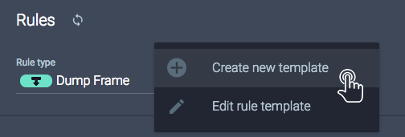

![logo][rookout-image]

## Setup

### Installation

Rookout sends data to Fluentd via a HTTP Webhook.


2. Setup [Rookout][rookout-url]

3. Log into [Rookout's webapp][rookout-app-url]

1. In the right panel (Rules) click on the menu button

    

1. Click on *Create new template* in order to edit a new rule template

    

1. Copy the Fluentd rule template [available here](rule-template.json) into the editor and replace the default rule template.


1. Click the save icon to save the template

    

1. Add the newly created rule to any application as you would normally !

### Configuration

Once you added the rule, you can replace the `url` to another Fluentd endpoint  
Change the `items` dictionary to output any information that you need to send

```json
"operations": [
      {
        "name": "web_hook",
        "target": {
          "url": "YOUR_FLUENTD_HTTP_INTEGRATION_ENDPOINT"
        },
        "items": {
          "function": "store.rookout.frame.function",
          "filename": "store.rookout.frame.filename",
          "line": "store.rookout.frame.line"
        }
      }
    ]
```

## Troubleshooting
If you have any questions, contact us at support@rookout.com.

## Further Reading
Find out more at [https://docs.rookout.com][rookout-docs]

[rookout-image]: logos/avatars-bot.png
[rookout-url]: https://docs.rookout.com/docs/getting-started.html
[rookout-docs]: https://docs.rookout.com/
[rookout-app-url]: https://app.rookout.com
[fluentd-url]: https://docs.fluentd.org/v0.12/articles/in_http
